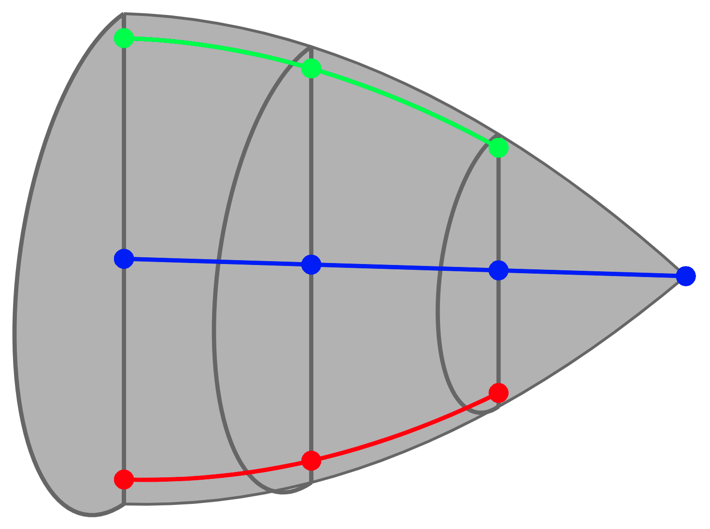

[][url_pypi_this_package]
[][url_read_the_docs_latest]
[](LICENSE)
[][url_latest_doi]
[](https://github.com/psf/black)
[](https://mybinder.org/v2/gh/JulianKarlBauer/orientation_averaging_mean_field/HEAD)

<p align="center">
  <a href="https://github.com/JulianKarlBauer/orientation_averaging_mean_field">
  
  </a>
</p>

# PlanarFibers

This repository contains a Python package called `planarfibers`  
which contains selected contributions of the paper

```bibtex
@article{BauerBoehlke2022,
    author = {Julian Karl Bauer and Thomas Böhlke},
    title = {On the dependence of orientation averaging mean field homogenization on planar fourth-order fiber orientation tensors},
    journal = {Mechanics of Materials},
    volume = {170},
    pages = {104307},
    year = {2022},
    issn = {0167-6636},
    doi = {https://doi.org/10.1016/j.mechmat.2022.104307},
    url = {https://www.sciencedirect.com/science/article/pii/S0167663622000886},
    keywords = {Fiber orientation tensor, Anisotropy, Elasticity, Small strain, Mean field homogenization, Fiber reinforced composites, Closure approximation},
}
```

Please see [license][url_license],
[acknowledgment](#acknowledgment)
and cite the [paper given above][url_article] and the latest [Zenodo-DOI][url_latest_doi].

## Installation

- [Clone][url_how_to_clone] this repository to your machine
- Open a terminal and navigate to your local clone
- Install the package from the local clone into the current [env][url_env_python]i[ronment][url_env_conda] in develop mode:
	```shell
	python setup.py develop
	```

Note: [Develop vs. install](https://stackoverflow.com/a/19048754/8935243)

## Examples

Both example notebooks and example scripts are rendered [here][url_read_the_docs_latest_notebooks] and given as source [here](docs/source/notebooks).

## Acknowledgment

The research documented in this repository has been funded by the German Research Foundation (DFG) within the
International Research Training Group [“Integrated engineering of continuous-discontinuous long fiber reinforced polymer structures“ (GRK 2078)][grk_website].
The support by the [German Research Foundation (DFG)][dfg_website] is gratefully acknowledged.

[grk_website]: https://www.grk2078.kit.edu/
[dfg_website]: https://www.dfg.de/

[url_license]: LICENSE
[url_latest_doi]: https://zenodo.org/badge/latestdoi/440932364
[url_article]: https://doi.org/10.1016/j.mechmat.2022.104307
[url_how_to_clone]: https://docs.github.com/en/repositories/creating-and-managing-repositories/cloning-a-repository

[url_env_python]: https://docs.python.org/3/tutorial/venv.html
[url_env_conda]: https://docs.conda.io/projects/conda/en/latest/user-guide/tasks/manage-environments.html

[url_read_the_docs_latest]: https://planarfibers.readthedocs.io/en/latest/
[url_read_the_docs_latest_notebooks]: https://planarfibers.readthedocs.io/en/latest/source/example_notebooks.html
[url_pypi_this_package]: https://pypi.org/project/planarfibers/0.0.1/
